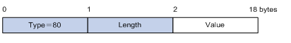

### 802.1x认证报文的交互机制
**客户端与设备端：** 设备端收到客户端的EAP报文后，对EAP报文使用EAP（Extensible Authentication Protocol over LAN，局域网上的可扩展认证协议）封装格式承载于数据帧中传递。
**设备端与服务器：** EAP报文的交互有EAP中继和EAP终结两种处理机制。
**1、EAP中继：** 设备端对收到的EAP报文进行中继，使用EAPOR（EAP over RADIUS）封装格式将其承载于RADIUS报文中发送给RADIUS服务器。

该处理机制下，EAP认证过程在客户端和RADIUS服务器之间进行。RADIUS服务器作为EAP服务器来处理客户端的EAP认证请求，设备相当于一个中继，仅对EAP报文做中转。因此，设备处理简单，并能够支持EAP的各种认证方法，但要求RADIUS服务器支持相应的EAP认证方法。

**2、EAP终结：**设备对EAP认证过程进行终结，将收到的EAP报文中的客户端认证信息封装在标准的RADIUS报文中，与服务器之间采用PAP（Password Authentication Protocol，密码验证协议）或CHAP（Challenge Handshake Authentication Protocol，质询握手验证协议）方法进行认证。 

该处理机制下，由于现有的RADIUS服务器基本均可支持PAP认证和CHAP认证，因此对服务器无特殊要求，但设备端处理较为复杂。设备端需要作为EAP服务器来解析与处理客户端的EAP报文，且目前仅能支持MD5-Challenge类型的EAP认证以及iNode 802.1X客户端发起的“用户名+密码”方式的EAP认证。

**说明：**
如果客户端采用了MD5-Challenge类型的EAP认证，则设备端只能采用CHAP认证；如果iNode 802.1X客户端采用了“用户名+密码”方式的EAP认证，设备上可选择使用PAP认证或CHAP认证，从安全性上考虑，通常使用CHAP认证。

### EAP报文的封装
**1.EAPOL数据帧的封装**

**（1）EAPOL数据帧的格式：** EAPOL是802.1X协议定义的一种承载EAP报文的封装技术，主要用于在局域网中传送客户端和设备端之间的EAP协议报文。

- PAE Ethernet Type：表示协议类型。EAPOL的协议类型为0x888E。
-   Protocol Version：表示EAPOL数据帧的发送方所支持的EAPOL协议版本号。
-  Type：表示EAPOL数据帧类型。目前设备支持的EAPOL数据帧类型：

-    Length：表示数据域的长度，也就是Packet Body字段的长度，单位为字节。当EAPOL数据帧的类型为EAPOL-Start或EAPOL-Logoff时，该字段值为0，表示后面没有Packet Body字段。
-   Packet Body：数据域的内容。
**（2）EAP报文格式：**当EAPOL数据帧的类型为EAP-Packet时，Packet Body字段的内容就是一个EAP报文，格式如下：

- Code：EAP报文的类型，包括Request（1）、Response（2）、Success（3）和Failure（4）。
-  Identifier：用于匹配Request消息和Response消息的标识符。
-    Length：EAP报文的长度，包含Code、Identifier、Length和Data域，单位为字节。
-   Data：EAP报文的内容，该字段仅在EAP报文的类型为Request和Response时存在，它由类型域和类型数据两部分组成，例如，类型域为1表示Identity类型，类型域为4表示MD5 challenge类型。

**2、EAP报文在RADIUS中的封装**
RADIUS为支持EAP认证增加了两个属性：**EAP-Message（EAP消息）** 和 **Message-Authenticator（消息认证码）**。在含有EAP-Message属性的数据包中，必须同时包含Message-Authenticator属性。
**（1）EAP-Message**
如图，EAP-Message属性用来封装EAP报文，Value域最长253字节，如果EAP报文长度大于253字节，可以对其进行分片，依次封装在多个EAP-Message属性中。

**（2）Message-Authenticator**
Message-Authenticator属性用于在EAP认证过程中验证携带了EAP-Message属性的RADIUS报文的完整性，避免报文被窜改。如果接收端对接收到的RADIUS报文计算出的完整性校验值与报文中携带的Message-Authenticator属性的Value值不一致，该报文会被认为无效而丢弃。

### 802.1x的认证触发方式
802.1X的认证过程可以由客户端主动发起，也可以由设备端发起。
**1.客户端主动触发方式**
- **组播触发：** 客户端主动向设备端发送EAPOL-Start报文来触发认证，该报文目的地址为组播MAC地址01-80-C2-00-00-03。
- **广播触发：** 客户端主动向设备端发送EAPOL-Start报文来触发认证，该报文的目的地址为广播MAC地址。该方式可解决由于网络中有些设备不支持上述的组播报文，而造成设备端无法收到客户端认证请求的问题。
**2.设备端主动触发方式**
设备端主动触发方式用于支持不能主动发送EAPOL-Start报文的客户端。设备主动触发认证的方式分为以下两种：
- **组播触发：** 设备每隔一定时间（缺省为30秒）主动向客户端组播发送Identity类型的EAP-Request帧来触发认证。
- **单播触发：**当设备收到源MAC地址未知的报文时，主动向该MAC地址单播发送Identity类型的EAP-Request帧来触发认证。若设备端在设置的时长内没有收到客户端的响应，则重发该报文。

### 802.1x的认证过程
设备端支持采用EAP中继方式或EAP终结方式与远端RADIUS服务器交互。以下关于802.1X认证过程的描述，都以**客户端主动发起认证** 为例。
**1.EAP中继方式**
这种方式是IEEE 802.1X标准规定的，将EAP承载在其它高层协议中，如EAP over RADIUS，以便EAP报文穿越复杂的网络到达认证服务器。一般来说，需要RADIUS服务器支持EAP属性：EAP-Message和Message-Authenticator。如图，以MD5-Challenge类型的EAP认证为例，具体认证过程如下。

(1) 		当用户需要访问外部网络时打开802.1X客户端程序，输入用户名和密码，发起连接请求。此时，客户端程序将向设备端发出认证请求帧（EAPOL-Start），开始启动一次认证过程。

(2)      设备端收到认证请求帧后，将发出一个Identity类型的请求帧（EAP-Request/Identity）要求用户的客户端程序发送输入的用户名。

(3)      客户端程序响应设备端发出的请求，将用户名信息通过Identity类型的响应帧（EAP-Response/Identity）发送给设备端。

(4)      设备端将客户端发送的响应帧中的EAP报文封装在RADIUS报文（RADIUS Access-Request）中发送给认证服务器进行处理。

(5)      RADIUS服务器收到设备端转发的用户名信息后，将该信息与数据库中的用户名列表对比，找到该用户名对应的密码信息，用随机生成的一个MD5 Challenge对密码进行加密处理，同时将此MD5 Challenge通过RADIUS Access-Challenge报文发送给设备端。

(6)      设备端将RADIUS服务器发送的MD5 Challenge转发给客户端。

(7)      客户端收到由设备端传来的MD5 Challenge后，用该Challenge对密码进行加密处理，生成EAP-Response/MD5 Challenge报文，并发送给设备端。

(8)      设备端将此EAP-Response/MD5 Challenge报文封装在RADIUS报文（RADIUS Access-Request）中发送给RADIUS服务器。

(9)      RADIUS服务器将收到的已加密的密码信息和本地经过加密运算后的密码信息进行对比，如果相同，则认为该用户为合法用户，并向设备端发送认证通过报文（RADIUS Access-Accept）。

(10)   设备收到认证通过报文后向客户端发送认证成功帧（EAP-Success），并将端口改为授权状态，允许用户通过端口访问网络。

(11)   用户在线期间，设备端会通过向客户端定期发送握手报文的方法，对用户的在线情况进行监测。

(12)   客户端收到握手报文后，向设备发送应答报文，表示用户仍然在线。缺省情况下，若设备端发送的两次握手请求报文都未得到客户端应答，设备端就会让用户下线，防止用户因为异常原因下线而设备无法感知。

(13)   客户端可以发送EAPOL-Logoff帧给设备端，主动要求下线。

(14)   设备端把端口状态从授权状态改变成未授权状态，并向客户端发送EAP-Failure报文。

**2.EAP终结方式**
这种方式将EAP报文在设备端终结并映射到RADIUS报文中，利用标准RADIUS协议完成认证、授权和计费。设备端与RADIUS服务器之间可以采用PAP或者CHAP认证方法。如图，以CHAP认证为例，具体的认证流程如下。

EAP终结方式与EAP中继方式的认证流程相比，不同之处在于用来对用户密码信息进行加密处理的MD5 challenge由设备端生成，之后设备端会把用户名、MD5 challenge和客户端加密后的密码信息一起发送给RADIUS服务器，进行相关的认证处理。

### 802.1x的接入控制方式
- **基于端口的接入控制机制：** 只要该端口下的第一个用户认证成功后，其它接入用户无须认证就可使用网络资源，但是当第一个用户下线后，其它用户也会被拒绝使用网络。
- **基于MAC的接入控制机制：**该端口下的所有接入用户均需要单独认证，当某个用户下线后，也只有该用户无法使用网络。

